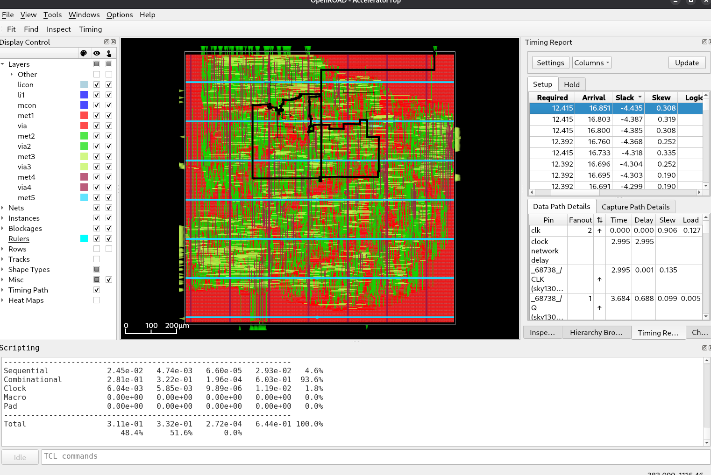

## Setup
```bash
sudo apt update && sudo apt upgrade -y
sudo apt install -y build-essential git make python3 python3-pip python3-venv
sudo apt install -y verilator iverilog yosys gtkwave

python3 -m venv .venv
source .venv/bin/activate

pip install cocotb pytest numpy
pip install torch --index-url https://download.pytorch.org/whl/cpu
```

## Uruchamianie testow cocotb
Trzy niezalezne testy, kazdy jako osobny target. Symulator wybiera sie
parametrem `SIM` (`verilator` lub `icarus`):

| Target            | Testowany modul                 | Plik testu                    |
|-------------------|----------------------------------|-------------------------------|
| `systolic_array`  | `SystolicTableWeightStationary` | `tests/SystolicArrayTest.py`  |
| `compute_core`    | `ComputeCore`                   | `tests/ComputeCoreTest.py`    |
| `accelerator_top` | `AcceleratorTop` (caly AXI)      | `tests/AcceleratorTopTest.py` |

```bash
make systolic_array SIM=verilator
make compute_core SIM=verilator
make accelerator_top SIM=verilator

make systolic_array SIM=icarus
make compute_core SIM=icarus
make accelerator_top SIM=icarus
```

Kazdy test buduje sie w osobnym katalogu (`sim_build_<nazwa>`), wiec mozna je
uruchamiac jeden po drugim bez `make clean`.


## Flow (synteza + PnR, sky130)

Wymaga [Nix](https://nixos.org/download/).
Przy pierwszym odpaleniu skrypt sam sklonuje OpenLane2, pobierze `sv2v` oraz
(dla wariantu z SRAM) pliki makr pamieci z `VLSIDA/sky130_sram_macros`.

```bash
cd flow
./build_sky130.sh
```

Backend pamieci (`MEM_BACKEND`) wybiera sie edytujac zmienna na poczatku
[build_sky130.sh](flow/build_sky130.sh):

| `MEM_BACKEND`  | Config                            | Opis                                  |
|----------------|------------------------------------|----------------------------------------|
| `GENERIC`      | `configs/sky130_generic.json`      | pamiec jako rejestry (bez hard macro) |
| `SKY130_SRAM`  | `configs/sky130_sram.json`         | 4x hard macro `sky130_sram_1kbyte_1rw1r_32x256_8` |


### Przegladanie wyniku w GUI OpenROAD

```bash
cd flow
./gui.sh
```

Mozna tez w ``gui.sh`` ustawic corner.


## Pomysly:
- podwojne buforowanie - ladujemy do bufora warstwe 2 w momencie kiedy liczy sie warstwa 1
- 


## TODO:
- AcceleratorTop
- AxiStream, AxiSlave
- fix ComputeCore - add data skewer - done
- zrobic obrazki maszyny stanow do ComputeCore


## Sram placement
```
grep -i "SIZE" /home/hubert/Desktop/studia/praca-inzynierska/silicon-bielik/vendor/sky130_sram/sky130_sram_1kbyte_1rw1r_32x256_8.lef
```
```
   SIZE 479.78 BY 397.5 ;
```

Having such sram bank size we can place 4 of them in config file with 500 micrometer gap between them.

Die area we set 1540 × 1375 micrometers.

